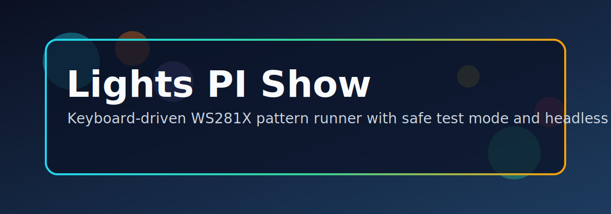

# Lights PI Show

WS281X LED pattern controller with a GTK3 graphical interface, a full CLI, safe local simulation mode, headless JSON configs, and cross-platform distribution builds.

[](https://github.com/Drizztdowhateva/Lights_PI_Show/actions/workflows/ci.yml)
[](LICENSE)



## Table of Contents

- [Features](#features)
- [SOS / Emergency Quick Start](#sos--emergency-quick-start)
- [Installation](#installation)
- [GUI Quick Start](#gui-quick-start)
- [CLI Quick Start](#cli-quick-start)
- [Patterns](#patterns)
- [Colors and Palettes](#colors-and-palettes)
- [Runtime Key Controls](#runtime-key-controls)
- [Headless Configs](#headless-configs)
- [Building Distributions](#building-distributions)
- [Project Structure](#project-structure)
- [Quality and Standards](#quality-and-standards)
- [Governance](#governance)
- [Support and Donations](#support-and-donations)

## Features

- **GTK3 GUI** — welcome screen, pattern toggle buttons, HSV color wheel, speed/brightness sliders, live LED preview
- **13 patterns** — Chase, Random, Bounce, Comet, Theater Chase, Rainbow Sweep, Pulse, Sparkle, Fire Flame, Meteor Shower, Twinkle Stars, and Emergency SOS
- **8 random palettes** — Any RGB, Warm, Cool, Pastel, Neon, Ocean, Fire, Forest
- **Custom color** — named color presets + full 256-color HSV wheel for non-rainbow patterns
- **CLI** — full keyboard control with arrow keys, speed/brightness hotkeys, named color discovery
- **Headless JSON** — save/load LED configs for background and scheduled runs
- **Distribution builds** — AppImage (Linux), EXE (Windows), DMG (macOS) via `runtimes/runtime_package.py`
- **Simulation mode** — `--test` / `python3 gui.py --test` runs without any hardware

## SOS / Emergency Quick Start

Immediate emergency SOS using the headless config:

```bash
sudo ./Lights.sh --headless --headless-config headless/headless_emergency_sos_red.json
```

Shortcut:

```bash
sudo ./Lights.sh --SOS
```

Stop it:

```bash
kill $(cat runtime_live.pid) 2>/dev/null || echo "No running process found"
```

## Installation

### CLI (Raspberry Pi / Linux)

`Lights.sh` creates and manages a `.venv` automatically:

```bash
git clone https://github.com/Drizztdowhateva/Lights_PI_Show.git
cd Lights_PI_Show
sudo ./Lights.sh
```

Or manually:

```bash
python3 -m venv .venv
source .venv/bin/activate
pip install -r requirements.txt
sudo .venv/bin/python3 into.py
```

### GUI (GTK3)

Install the GTK3 system packages (not available via pip):

```bash
# Debian / Ubuntu / Raspberry Pi OS
sudo apt install python3-gi python3-gi-cairo gir1.2-gtk-3.0

# macOS
brew install gtk+3 pygobject3

# Windows (MSYS2 MinGW64)
pacman -S mingw-w64-x86_64-gtk3 mingw-w64-x86_64-python-gobject
```

Then run:

```bash
python3 gui.py
```

## GUI Quick Start

```bash
# Simulation mode — no hardware needed
python3 gui.py --test

# Hardware mode
sudo python3 gui.py
```

1. Welcome screen → click **Get Started**
2. Pick a pattern from the button grid
3. Adjust Speed and Brightness sliders
4. Choose a color (wheel shown for applicable patterns)
5. Click **▶ Start** — the preview animates in real time
6. Click **⏹ Stop** or close the window

## CLI Quick Start

Simulation (no hardware):

```bash
python3 into.py --test --pattern 1 --speed 3 --frames 30
```

Hardware:

```bash
sudo ./Lights.sh --pattern 5 --speed 6 --frames 0
```

Custom color:

```bash
python3 into.py --pattern 5 --custom-color "#FF4400" --test
python3 into.py --show-colors          # list all named color presets
```

## Patterns

| Key | Name | Custom Color |
|-----|------|--------------|
| `-1` | Emergency SOS | — |
| `1` | Chase | Preset / Custom |
| `2` | Random | Palette |
| `3` | Bounce | Preset / Custom |
| `4` | Random (alt) | Palette |
| `5` | Comet | Custom |
| `6` | Theater Chase | Custom |
| `7` | Rainbow Sweep | — |
| `8` | Pulse | Custom |
| `9` | Sparkle | Custom |
| `10` | Fire Flame | — |
| `11` | Meteor Shower | Custom |
| `12` | Twinkle Stars | Custom |

## Colors and Palettes

Custom color formats accepted by `--custom-color`:

```
--custom-color "red"          # named preset
--custom-color "#FF4400"      # hex
--custom-color "255,68,0"     # r,g,b
```

List all named presets:

```bash
python3 into.py --show-colors
```

Random palettes (`--random-palette 1`..`8`):
`Any RGB`, `Warm`, `Cool`, `Pastel`, `Neon`, `Ocean`, `Fire`, `Forest`

## Runtime Key Controls

| Key | Action |
|-----|--------|
| `←` `→` | Cycle pattern |
| `↑` `↓` | Brightness ±16 |
| `+` / `=` | Speed up |
| `-` | Slow down |
| `1`–`9` | Jump to pattern |
| `c` | Cycle color preset |
| `n` | Show named color list |
| `b` | Toggle brightness cycle |
| `q` / `Ctrl+C` | Quit |

## Headless Configs

Pre-built configs in `headless/`:

| File | Description |
|------|-------------|
| `headless_settings.json` | Default startup config |
| `headless_chase_rainbow.json` | Rainbow chase |
| `headless_bounce_blue.json` | Blue bounce |
| `headless_random_warm.json` | Warm random |
| `headless_emergency_sos_red.json` | Emergency SOS |

Run headless:

```bash
sudo ./Lights.sh --headless --headless-config headless/headless_settings.json
```

Save current settings to headless JSON:

```bash
python3 into.py --export-headless my_config
```

## Building Distributions

`runtimes/runtime_package.py` builds self-contained bundles via PyInstaller.

```bash
# CLI builds
python3 runtimes/runtime_package.py appimage
python3 runtimes/runtime_package.py exe
python3 runtimes/runtime_package.py dmg

# GUI builds (GTK3 — self-contained AppImage/EXE/DMG)
python3 runtimes/runtime_package.py appimage --gui
python3 runtimes/runtime_package.py exe      --gui
python3 runtimes/runtime_package.py dmg      --gui
```

Output lands in `dist/`. See [runtimes/README.md](runtimes/README.md) for per-platform requirements.

## Project Structure

```text
Lights_PI_Show/
├── into.py                        # CLI pattern runner (backend)
├── gui.py                         # GTK3 graphical interface
├── Lights.sh                      # CLI launcher (auto-venv, deps)
├── setup_permissions.sh           # Grant hardware capabilities without sudo
├── requirements.txt               # Python dependencies
├── headless/                      # Saved headless JSON configs
├── media/                         # Banner, screenshots, assets
├── runtimes/
│   └── runtime_package.py         # AppImage / EXE / DMG builder
└── .github/workflows/ci.yml       # CI validation
```

## Quality and Standards

- CI checks run on every push — see `.github/workflows/ci.yml`.
- Keep paths relative; no hard-coded home-directory paths.
- Never commit API keys or secrets.
- Use `--test` / `python3 gui.py --test` during development when hardware is unavailable.

## Governance

- Code of Conduct: [CODE_OF_CONDUCT.md](CODE_OF_CONDUCT.md)
- Contributing: [CONTRIBUTING.md](CONTRIBUTING.md)
- License: [LICENSE](LICENSE)
- Changelog: [CHANGELOG.md](CHANGELOG.md)

## Support and Donations

If this project helps your workflow, support is appreciated:

- GitHub Sponsors: `https://github.com/sponsors/Drizztdowhateva`
- Cash App: `https://cash.app/$teerRight`
- GitHub Profile: `https://github.com/Drizztdowhateva`
- WhatsApp: https://wa.me/13127235816
